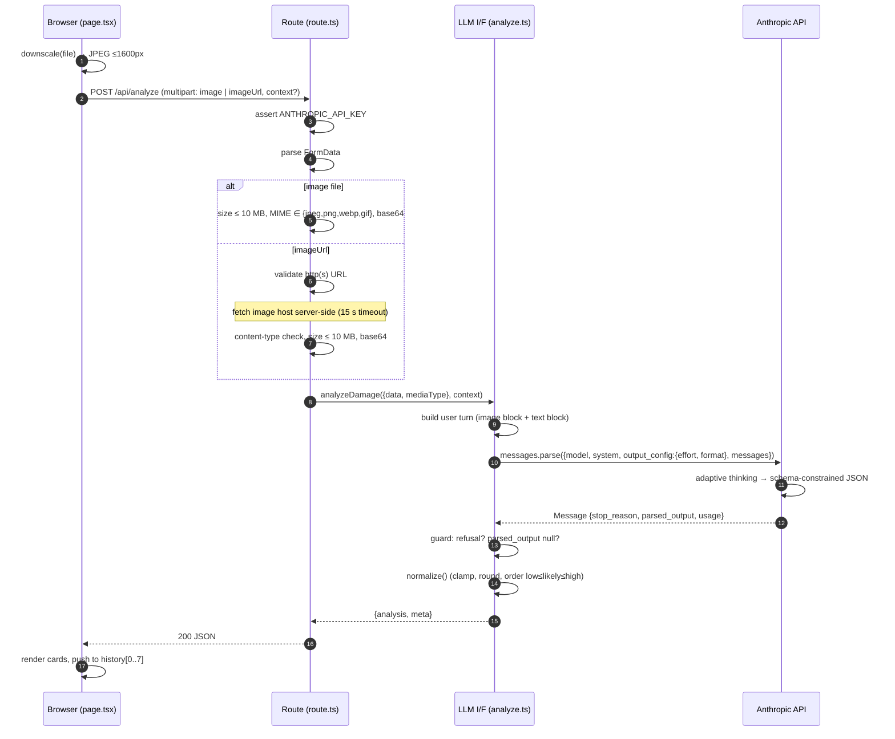

# Fenderly Technical Architecture

This document describes how Fenderly is built, from the browser to the Anthropic API and back. The centre of the system is the **LLM interface** in `lib/analyze.ts`: one function, one model call, one schema. Everything else exists to get a clean image into that call and a typed result out of it.

Companion documents: [README](../README.md) (setup and product overview), [Backend One-Pager](BACKEND.md) (route-level walkthrough), [Production Readiness Plan](PRODUCTION_READINESS_PLAN_CISO.md).

---

## Contents

1. [Design principles](#1-design-principles)
2. [System topology](#2-system-topology)
3. [Request lifecycle](#3-request-lifecycle)
4. [The LLM interface](#4-the-llm-interface) **(key section)**
   - 4.1 [Where it lives and what it owns](#41-where-it-lives-and-what-it-owns)
   - 4.2 [Anatomy of the request](#42-anatomy-of-the-request)
   - 4.3 [Model and effort configuration](#43-model-and-effort-configuration)
   - 4.4 [Prompting strategy](#44-prompting-strategy)
   - 4.5 [Structured outputs: the schema as the contract](#45-structured-outputs-the-schema-as-the-contract)
   - 4.6 [Thinking and reasoning depth](#46-thinking-and-reasoning-depth)
   - 4.7 [Response handling and guarantees](#47-response-handling-and-guarantees)
   - 4.8 [Post-processing: normalize()](#48-post-processing-normalize)
   - 4.9 [Observability metadata](#49-observability-metadata)
   - 4.10 [Error taxonomy](#410-error-taxonomy)
   - 4.11 [Cost and latency model](#411-cost-and-latency-model)
   - 4.12 [Extension points](#412-extension-points)
5. [Data contract: lib/schema.ts](#5-data-contract-libschemats)
6. [API route: app/api/analyze/route.ts](#6-api-route-appapianalyzeroutets)
7. [Front end: app/page.tsx](#7-front-end-apppagetsx)
8. [Runtime, build, and deployment](#8-runtime-build-and-deployment)
9. [Security and operational boundaries](#9-security-and-operational-boundaries)
10. [Trade-offs and known limits](#10-trade-offs-and-known-limits)

---

## 1. Design principles

| Principle | What it means in this codebase |
| --- | --- |
| **One model call does the whole job** | Vehicle identification, damage description, hidden-damage inference, and cost estimation are a single request to Claude. There is no pipeline, no per-task model, no orchestration layer. |
| **Schema is the single source of truth** | The Zod schema in `lib/schema.ts` is sent to the API as the output format, types the server response, and types the React props. Three consumers, one definition. |
| **Server owns the bytes** | The browser never talks to Anthropic. The API route receives the image, validates it, encodes it, and makes the call. URLs are fetched server-side so the model sees exactly what the user previewed. |
| **Fail loudly, not creatively** | No JSON-repair code, no retries that mask errors, no fallback figures. If the model refuses or the output does not parse, the route returns a typed error. |
| **Minimal surface area** | One page, one route, two library files, no database, no auth, no component framework. Appropriate for a time-boxed prototype; the production path is described in the SOW. |

---

## 2. System topology

```
┌────────────────────────────┐      ┌────────────────────────────────┐      ┌──────────────────────────┐
│  Browser                   │      │  Next.js server (Node runtime) │      │  Anthropic API           │
│  app/page.tsx              │      │                                │      │  POST /v1/messages       │
│                            │      │  app/api/analyze/route.ts      │      │                          │
│  • upload / URL / context  │      │   • env check                  │      │  model: claude-opus-5    │
│  • canvas downscale        │ ───► │   • multipart parse            │ ───► │  vision input            │
│    (1600 px, JPEG 0.9)     │ POST │   • size + MIME validation     │ SDK  │  adaptive thinking       │
│  • results cards           │      │   • server-side URL fetch      │      │  structured output       │
│  • raw JSON view           │ ◄─── │   • base64 encode              │ ◄─── │  (JSON schema from Zod)  │
│  • session history (8)     │ JSON │                                │ JSON │                          │
│                            │      │  lib/analyze.ts  ◄── LLM I/F   │      │                          │
│                            │      │   • system prompt              │      │                          │
│                            │      │   • messages.parse()           │      │                          │
│                            │      │   • refusal / parse guards     │      │                          │
│                            │      │   • normalize()                │      │                          │
│                            │      │                                │      │                          │
│  lib/schema.ts (types) ◄───┼──────┼── lib/schema.ts (Zod) ─────────┼──────┼─► output_config.format   │
└────────────────────────────┘      └────────────────────────────────┘      └──────────────────────────┘
```

### Component inventory

| Layer | File | Responsibility | Runs on |
| --- | --- | --- | --- |
| UI | `app/page.tsx` | Input capture, client-side downscale, POST to API, rendering, session history | Browser |
| Shell | `app/layout.tsx`, `app/globals.css` | HTML shell, metadata, plain-CSS styling | Server render + browser |
| HTTP boundary | `app/api/analyze/route.ts` | Input validation, URL fetching, base64 encoding, error-to-HTTP mapping | Node.js (server) |
| **LLM interface** | `lib/analyze.ts` | System prompt, model configuration, Anthropic SDK call, response guards, normalization | Node.js (server) |
| Contract | `lib/schema.ts` | Zod schema + inferred TypeScript types shared by all layers | Both (schema on server, types everywhere) |

### Dependencies

| Package | Version | Role |
| --- | --- | --- |
| `next` | 16.x | App Router, route handlers, Vercel deployment target |
| `react` / `react-dom` | 19.x | Client page |
| `@anthropic-ai/sdk` | 0.124.x | Messages API client, `messages.parse()`, `zodOutputFormat()`, typed errors |
| `zod` | 4.x | Schema definition and TypeScript inference |
| `typescript` | 5.8 | Type checking (`npm run typecheck`) |

There is no database, queue, cache, or auth provider. State lives in React component state for the duration of a page session.

---

## 3. Request lifecycle



**Timing budget.** The route declares `maxDuration = 120` seconds. The URL fetch has its own 15 second abort. The model call is the dominant cost; at `effort: "high"` on Opus 5 a typical claim photo returns in tens of seconds, so the 120 second ceiling leaves headroom for `xhigh`/`max` effort or slow hosts.

---

## 4. The LLM interface

This is the core of the system and the section to read if you read only one.

### 4.1 Where it lives and what it owns

The entire interface to the model is a single exported function in [lib/analyze.ts](../lib/analyze.ts):

```ts
export async function analyzeDamage(
  image: ImageInput,        // { data: base64, mediaType: "image/jpeg" | "image/png" | "image/webp" | "image/gif" }
  context?: string,         // optional free text from the claimant or adjuster
): Promise<AnalyzeResponse> // { analysis: Analysis, meta: {...} }
```

The function owns five things, and nothing else in the codebase touches them:

1. **Model selection and effort** (`MODEL`, `EFFORT` constants, env-overridable).
2. **The system prompt** (`SYSTEM_PROMPT`, a fixed string).
3. **The request shape** sent to the Anthropic SDK.
4. **Response guards** for refusals and unparseable output.
5. **Normalization** of the parsed result before it leaves the module.

The route handler treats `analyzeDamage()` as a black box that either returns a fully-typed `AnalyzeResponse` or throws. That separation is deliberate: the HTTP layer knows about multipart forms and status codes, the LLM layer knows about prompts and schemas, and the boundary between them is the `ImageInput` type.

### 4.2 Anatomy of the request

The call at [lib/analyze.ts:48](../lib/analyze.ts#L48) is:

```ts
const response = await client.messages.parse({
  model: MODEL,                              // "claude-opus-5" by default
  max_tokens: 8000,                          // ceiling on generated tokens (thinking + JSON)
  system: SYSTEM_PROMPT,                     // appraiser persona and working rules
  output_config: {
    effort: EFFORT,                          // "high" by default
    format: zodOutputFormat(Analysis),       // JSON schema derived from lib/schema.ts
  },
  messages: [
    {
      role: "user",
      content: [
        { type: "image", source: { type: "base64", media_type: image.mediaType, data: image.data } },
        { type: "text",  text: userText },   // "Assess the damage in this claim photo." (+ context)
      ],
    },
  ],
});
```

Each field, and why it is set the way it is:

| Field | Value | Rationale |
| --- | --- | --- |
| `client.messages.parse` | SDK helper, not `create` | `parse()` is the structured-output entry point. It sends the schema, validates the returned JSON against it, and exposes the typed result as `response.parsed_output`. Using `create()` would require hand-parsing the text block. |
| `model` | `claude-opus-5` | Vision-capable, adaptive thinking on by default, strongest judgement for a pricing task. See 4.3. |
| `max_tokens` | `8000` | The schema output is typically 1 to 2K tokens. The rest is headroom for thinking at high effort. If this cap is hit the SDK reports `stop_reason: "max_tokens"` and `parsed_output` will be null, which the guard in 4.7 catches. |
| `system` | Fixed string | Persona and rules are stable across requests. Keeping them in `system` rather than the user turn separates operator instructions from claimant-supplied text. See 4.4 and 9. |
| `output_config.effort` | `high` | Controls how much the model reasons before committing to figures. See 4.6. |
| `output_config.format` | `zodOutputFormat(Analysis)` | Converts the Zod schema to the JSON Schema the API enforces. The model cannot return a shape outside it. See 4.5. |
| `messages[0].content` | `[image, text]` | Image block first, text after. This is the ordering the API documents for vision prompts. Only one user turn; the API is stateless and there is no conversation history. |
| `thinking` | *(omitted)* | On Opus 5, omitting `thinking` runs adaptive thinking. There is nothing to configure. See 4.6. |

**What is deliberately absent.** No `tools`, no `tool_choice`, no `temperature` (removed on Opus 5), no `cache_control` (the prefix is too short to cache, see 4.11), no streaming (a single non-streaming call is simpler and the 8000 token cap keeps it inside SDK timeouts), no `betas`.

### 4.3 Model and effort configuration

```ts
export const MODEL  = process.env.CLAUDE_MODEL  ?? "claude-opus-5";
export const EFFORT = (process.env.CLAUDE_EFFORT ?? "high") as "low" | "medium" | "high" | "xhigh" | "max";
```

Both are read once at module load and exported so the route and UI footer can display them.

| Variable | Default | Effect |
| --- | --- | --- |
| `CLAUDE_MODEL` | `claude-opus-5` | Any vision-capable Claude model. The code assumes the Opus 5 API surface (adaptive thinking on by default, `output_config.effort` supported, no sampling params). Older models may need a `thinking` block; Haiku 4.5 does not accept `effort`. |
| `CLAUDE_EFFORT` | `high` | Passed straight to `output_config.effort`. Lower is faster and cheaper; `xhigh`/`max` spend more thinking tokens on harder photos. |

**Provider route (production target).** Enterprise deployment adds `MODEL_PROVIDER` (`anthropic`, `bedrock`, `vertex`, `foundry`) and a region setting. The only provider-specific code is client construction: `new Anthropic()` becomes the Bedrock, Vertex, or Foundry client class from the SDK, and the `messages.parse()` call is unchanged. A European insurer will normally choose an EU-region cloud route it already approves, or the Anthropic API under a data processing agreement with zero-retention terms and a transfer impact assessment. The choice is recorded in the DPIA and the DORA register (see the [Production Readiness Plan](PRODUCTION_READINESS_PLAN_CISO.md), section 5).

**Why Opus rather than a smaller model.** The estimate is a judgement task, not extraction. The model must recognise a 1994 Mustang from a grille, infer that a crumpled fender likely bent the hood hinge, and price OEM versus aftermarket parts by vehicle age. Those are the places where model quality shows in the output. The trade-off is latency and cost per call (see 4.11), which is acceptable for an adjuster-in-the-loop workflow.

**The cast is unchecked.** `CLAUDE_EFFORT` is cast to the union type without validation. An invalid value reaches the API and comes back as a `BadRequestError`, which the route maps to a 502 with the API's message. That is acceptable for a prototype; production would validate at startup.

### 4.4 Prompting strategy

The prompt has two parts: a fixed system prompt and a short user turn.

#### System prompt

The full text is at [lib/analyze.ts:22](../lib/analyze.ts#L22). Its structure:

| Section | Content | Purpose |
| --- | --- | --- |
| Persona | "senior auto physical-damage appraiser working for a US auto insurer… first-pass assessment that a human adjuster will verify" | Sets register (appraisal note, not essay) and makes the human-in-the-loop explicit, which licenses the model to commit to figures rather than hedge. |
| Identification rule | Identify from concrete cues; pick the most likely candidate and lower `identification_confidence`; return `"Unknown"` rather than invent | Directly targets the hallucination failure mode for make/model. Ties the prose rule to a schema field. |
| Visibility rule | Describe only visible damage; distinguish visible from likely hidden | Maps to `damage.areas` versus `damage.likely_hidden_damage`. Keeps the adjuster's inspection list separate from what the photo proves. |
| Color rule | Paint color, not lighting | Prevents "dark grey" for a black car under a streetlight. |
| Pricing rule | Independent US shop; OEM parts unless >10 years old; body labor at about $60 to 75/hour; paint and materials; blend adjacent panels; state assumptions; USD | Anchors the estimate to a stated, checkable basis. The assumptions land in `estimate.assumptions` so the adjuster can see and adjust them. |
| Non-vehicle rule | `is_vehicle_image = false`, describe what is seen in `damage.summary`, zero-cost estimate, empty line items | Gives the model a valid schema-conformant path for garbage input instead of forcing a fabricated car. |
| Style | Concise, concrete, appraisal-note register | Shorter output, fewer tokens, easier to render. |

The prompt is rules, not a checklist. Field-level guidance lives in the schema descriptions (4.5), so the two halves do not duplicate each other.

**Production: one template with a country block.** The prototype's pricing rule is written for a US independent shop. For a European insurer the persona and the pricing rule become a template rendered per country and legal entity: language of the output, currency and VAT treatment, labour rate source (the insurer's repairer network terms or the estimating provider), parts sourcing norms, and the total-loss basis (UK ABI salvage categories, the German 130 percent rule, the French VEI procedure). Country rules are configuration with their own evaluation slices, not forked prompts.

#### User turn

```ts
const userText = context?.trim()
  ? `Assess the damage in this claim photo. Additional context from the claimant or adjuster: "${context.trim()}"`
  : "Assess the damage in this claim photo.";
```

The `context` field is the only user-controlled text that reaches the model. It is quoted and explicitly attributed ("from the claimant or adjuster") so the model treats it as evidence, not instruction. A first-notice-of-loss style note such as "rear-ended in a parking lot, 2019 Civic" measurably improves make/model identification and the plausibility of hidden-damage calls. See section 9 for the prompt-injection boundary.

### 4.5 Structured outputs: the schema as the contract

This is the mechanism that makes the rest of the system simple.

```
lib/schema.ts                 lib/analyze.ts                    Anthropic API
─────────────                 ──────────────                    ─────────────
Analysis = z.object({...})  ─► zodOutputFormat(Analysis) ─────► output_config.format (JSON Schema)
        │                                                              │
        │  z.infer<typeof Analysis>                                    │  constrained decoding
        ▼                                                              ▼
type Analysis  ◄──────────── response.parsed_output  ◄──────────── JSON text block
        │
        ├──► AnalyzeResponse.analysis   (route return type)
        └──► Results / VehicleCard / DamageCard / EstimateCard props (page.tsx)
```

**How it works.**

1. `zodOutputFormat(Analysis)` (from `@anthropic-ai/sdk/helpers/zod`) serialises the Zod schema to JSON Schema and wraps it in the `output_config.format` object the API expects.
2. The API constrains generation so the returned JSON validates against that schema. Enums (`Severity`, `operation`, `total_loss_risk`), literals (`currency: "USD"`), required fields, and nesting are all enforced server-side.
3. `messages.parse()` validates the returned text with the same Zod schema on the client side and sets `response.parsed_output` to a typed `Analysis` object, or `null` if validation fails.
4. Every `.describe()` string on a schema field is carried into the JSON Schema as a `description`, so the model reads them as instructions. For example `year_range` carries "Approximate model years, e.g. '2018-2021', or 'Unknown'" and `recommended_next_steps` carries "2 to 4 short actions for the adjuster". This is where most of the field-level prompting lives.

**What this removes from the codebase.**

- No regex or bracket-matching to extract JSON from prose.
- No "please respond only with JSON" instructions and no retry-on-parse-failure loop.
- No runtime `typeof` checks on the client. The React components receive `Analysis` and destructure it directly.
- No drift between what the model returns and what the UI renders. Adding a field means editing one file; TypeScript then flags every consumer that needs updating.

**Constraints this imposes.**

- Structured outputs are incompatible with citations and with assistant prefill, neither of which is used.
- The schema must be expressible in the API's supported JSON Schema subset. The current schema uses only objects, arrays, strings, numbers, booleans, enums, and one literal, all of which are supported.
- Numeric bounds (`identification_confidence` in `[0,1]`, `low ≤ likely ≤ high`) are described in prose, not enforced by the schema. `normalize()` (4.8) closes that gap.

### 4.6 Thinking and reasoning depth

On Claude Opus 5, thinking is on by default and adaptive: the model decides how much to reason based on the task. The code omits the `thinking` parameter entirely, which is the recommended configuration. Sending `{type: "enabled", budget_tokens: N}` would be rejected with a 400 on this model.

Depth is controlled by `output_config.effort`:

| Effort | Behaviour | When to use |
| --- | --- | --- |
| `low` | Minimal reasoning, fastest | Batch triage, simple photos, cost-sensitive paths |
| `medium` | Moderate | Step-down from `high` if latency matters and quality holds |
| `high` (default) | Substantial reasoning before committing | Default for a judgement task with money attached |
| `xhigh` | More | Hard photos: partial views, ambiguous makes, multi-panel damage |
| `max` | Maximum | When correctness matters more than cost |

The thinking content itself is not returned (Opus 5 defaults `display` to `"omitted"`), and the code does not request it. Thinking tokens are billed as output tokens and appear in `usage.output_tokens`, which is why `meta.output_tokens` in the response is larger than the size of the JSON alone.

`max_tokens: 8000` bounds thinking plus output together. At `max` effort on a complex photo this could in principle be exhausted; the symptom would be a "did not match the expected format" error from the guard in 4.7. Raising the cap or switching to streaming are the two remedies (4.12).

### 4.7 Response handling and guarantees

After the call, two guards run before anything is returned:

```ts
if (response.stop_reason === "refusal") {
  throw new Error(`The model declined to analyze this image${
    response.stop_details?.explanation ? `: ${response.stop_details.explanation}` : "."
  }`);
}

if (!response.parsed_output) {
  throw new Error("The model returned a response that did not match the expected format.");
}
```

| Condition | Meaning | What the user sees |
| --- | --- | --- |
| `stop_reason === "refusal"` | The model's safety layer declined the request. `stop_details` carries a category and optional explanation. Returned as HTTP 200 by the API, so it must be checked explicitly. | 502 with "The model declined to analyze this image: …" |
| `parsed_output === null` | Output did not validate against the schema, or generation was cut off (`stop_reason: "max_tokens"`). | 502 with "did not match the expected format" |
| Both guards pass | `parsed_output` is a fully-typed `Analysis` | Normalized result, HTTP 200 |

**Guarantees the interface makes to its callers.** If `analyzeDamage()` returns, then:

- `analysis` conforms to the `Analysis` schema (enforced by the API and re-validated by the SDK).
- `analysis.estimate.low_usd ≤ likely_usd ≤ high_usd`, all non-negative integers.
- `analysis.vehicle.identification_confidence ∈ [0, 1]`.
- `meta` carries the model actually used, the effort requested, wall-clock latency, and token counts.

Anything else throws. The route converts throws to HTTP errors (4.10).

### 4.8 Post-processing: normalize()

```ts
function normalize(a: Analysis): Analysis {
  const low    = Math.max(0, Math.min(a.estimate.low_usd, a.estimate.high_usd));
  const high   = Math.max(a.estimate.low_usd, a.estimate.high_usd, 0);
  const likely = Math.min(Math.max(a.estimate.likely_usd, low), high);
  return { ...a,
    vehicle:  { ...a.vehicle,  identification_confidence: clamp01(...) },
    estimate: { ...a.estimate, low_usd: round(low), high_usd: round(high), likely_usd: round(likely) },
  };
}
```

This is a small, pure, idempotent pass that fixes the numeric invariants the schema cannot express. It does not change any text, any line item, or any classification. Its only job is to guarantee that the UI never renders an inverted range or an out-of-bounds confidence. It runs on every response regardless of whether the model got it right, so the guarantee holds without depending on model behaviour.

### 4.9 Observability metadata

Every successful response carries a `meta` object built from the SDK response:

| Field | Source | Use |
| --- | --- | --- |
| `model` | `response.model` | The exact model ID the API served, which may differ from the requested alias |
| `effort` | `EFFORT` constant | Which effort level produced this result |
| `duration_ms` | `Date.now() - started`, measured around the SDK call only | Latency of the model call, excluding upload and URL fetch |
| `input_tokens` | `response.usage.input_tokens` | Image plus prompt cost; the image dominates |
| `output_tokens` | `response.usage.output_tokens` | JSON plus thinking tokens |

The UI renders these in a footer under the results. For an integration, they are enough to compute per-call cost and to spot latency regressions when changing effort or model. Cache-related usage fields are not surfaced because caching is not used (4.11).

### 4.10 Error taxonomy

`analyzeDamage()` throws plain `Error` for the two guard conditions and lets SDK errors propagate. The route's `describeError()` at [route.ts:113](../app/api/analyze/route.ts#L113) maps them, most specific first:

| Thrown | Mapped message | HTTP |
| --- | --- | --- |
| `Anthropic.AuthenticationError` | "The Anthropic API key was rejected. Check ANTHROPIC_API_KEY." | 502 |
| `Anthropic.RateLimitError` | "The AI service is rate-limited right now. Please retry in a moment." | 502 |
| `Anthropic.BadRequestError` | "The AI service rejected the request: " + API message | 502 |
| `Anthropic.APIError` (any other status) | "AI service error (status): " + message | 502 |
| Refusal guard | "The model declined to analyze this image…" | 502 |
| Parse guard | "The model returned a response that did not match the expected format." | 502 |

The SDK's built-in retry (default two attempts on 408/409/429/5xx and connection errors) runs before any of these surface, so a transient upstream blip is usually absorbed silently. Note that upstream messages are passed through to the client for `BadRequestError` and generic `APIError`; the design-weaknesses doc flags this as something to redact in production.

### 4.11 Cost and latency model

**Input tokens.** An image costs roughly `(width × height) / 750` tokens. The browser downscales uploads to a 1600 px long edge, so a 4:3 photo lands at about 1600 × 1200 ≈ 2,560 tokens. The system prompt and user text add a few hundred more. Total input is typically around 3K tokens per call.

**Output tokens.** The JSON payload is usually 800 to 2,000 tokens. Thinking at `high` effort adds a variable amount on top, all counted as output. `max_tokens: 8000` is the hard ceiling.

**Indicative pricing** (Anthropic first-party rates for Claude Opus 5, USD per million tokens):

| | Input | Output |
| --- | --- | --- |
| Opus 5 | $5.00 | $25.00 |

At around 3K input and a few thousand output tokens, a single analysis costs in the low tens of cents. Effort is the main lever: dropping to `medium` or `low` reduces thinking tokens and latency; raising to `xhigh` or `max` does the reverse.

**Why prompt caching is not used.** Caching is a prefix match with a model-dependent minimum cacheable length (on the order of a thousand tokens or more). The system prompt is a few hundred tokens and the image, which is the bulk of the input, changes every request. There is no stable prefix long enough to cache, so `cache_control` would add nothing. If the system prompt grew to include a pricing table or labor-rate reference, caching it would become worthwhile.

**Latency.** Dominated by the model call. Contributing factors in order: effort level, image complexity, and output length. The route's 120 second `maxDuration` and the SDK's default timeout (10 minutes, scaled for `max_tokens`) are both well above observed latencies at `high` effort.

### 4.12 Extension points

The interface is designed so each of these is a local change to `lib/analyze.ts` and, where noted, `lib/schema.ts`:

| Extension | Change | Notes |
| --- | --- | --- |
| **Multi-photo claims** | Accept `ImageInput[]`, push one image block per photo into `content` before the text block | Schema unchanged. Prompt should ask the model to cross-reference angles. |
| **Streaming** | Switch to `client.messages.stream()` and use `finalMessage()` (or per-event handling to show the vehicle card before the estimate lands) | Also lifts the `max_tokens` timeout concern and allows a much larger cap. |
| **Grounded pricing via tools** | Add `tools` for parts-price lookup and regional labor rates; drive the loop with the SDK tool runner; keep `output_config.format` for the final answer | Moves numbers from model priors to tables. The biggest quality lever for the estimate. |
| **VIN / plate OCR first** | A cheap preliminary call (or a tool) that pins make/model/year, injected into the user turn as context | Reduces identification ambiguity before the expensive call. |
| **Prompt caching** | Add `cache_control` to the system block once it carries a large stable reference (pricing tables, shop rate cards) | Only pays off past the minimum cacheable prefix. |
| **Model swap** | Set `CLAUDE_MODEL` | Requires no code change within the Opus 5 / Sonnet 5 family. Pre-4.6 models need an explicit `thinking` block and reject `effort`. |
| **Schema evolution** | Edit `lib/schema.ts` | TypeScript flags every UI consumer. The API picks up the new shape automatically through `zodOutputFormat`. Keep new numeric invariants in `normalize()`. |
| **Refusal fallback** | Add the server-side `fallbacks` parameter (beta) so a refusal on the primary model re-runs on a fallback inside the same request | Optional; today a refusal surfaces to the user as a 502. |
| **Evaluation harness** | Call `analyzeDamage()` directly from a script over a labelled photo set; compare `analysis` against adjuster grades | The function is already pure enough to drive without HTTP. |

---

## 5. Data contract: lib/schema.ts

The schema is organised as four top-level concerns plus two lists. Every string field carries a `.describe()` that the model sees.

```
Analysis
├── is_vehicle_image: boolean                       # false → zero-cost, empty line items
├── vehicle
│   ├── make, model, year_range: string             # "Unknown" allowed
│   ├── color, body_type: string
│   └── identification_confidence: number          # 0..1 (clamped by normalize)
├── damage
│   ├── summary: string                             # one or two adjuster-style sentences
│   ├── overall_severity: Severity                  # minor | moderate | severe | total_loss
│   ├── areas: DamageArea[]                         # location, damage_type, description, severity
│   ├── likely_hidden_damage: string[]              # things to inspect, not visible
│   ├── drivable: boolean
│   └── airbags_deployed: boolean                   # true only if visible
├── estimate
│   ├── currency: "USD"                             # literal
│   ├── low_usd, high_usd, likely_usd: number       # ordered and rounded by normalize
│   ├── line_items: LineItem[]                      # item, operation, cost_low_usd, cost_high_usd
│   ├── total_loss_risk: low | medium | high
│   └── assumptions: string[]                       # labor rate, OEM vs aftermarket, region
├── image_quality_notes: string[]                   # blur, glare, partial view
└── recommended_next_steps: string[]                # 2 to 4 adjuster actions
```

Exported artefacts:

| Export | Kind | Used by |
| --- | --- | --- |
| `Severity`, `DamageArea`, `LineItem`, `Analysis` | Zod schemas | `analyze.ts` (via `zodOutputFormat`) |
| `Severity`, `Analysis` (types) | `z.infer` | `analyze.ts`, `page.tsx` |
| `AnalyzeResponse` | Plain TS type `{ analysis, meta }` | `analyze.ts` return, `route.ts` response, `page.tsx` state |

The schema is intentionally flat where it can be and avoids optional fields. Every field is required, so the UI never has to branch on presence; empty arrays and `"Unknown"` strings are the explicit "nothing here" values.

**Production localisation fields.** The European deployment replaces the `"USD"` literal with a `currency` enum (`EUR`, `GBP`, `CHF`, `PLN`, extended as entities are added) and adds `country`, `vat_included`, `total_loss_basis` (the country rule the risk flag was judged against), and an optional `registration_number` used for the vehicle lookup and never written to logs unmasked. The `_usd` suffixes become `_amount` with the currency carried alongside. Each is an additive change; TypeScript flags every consumer.

---

## 6. API route: app/api/analyze/route.ts

A single `POST` handler. Route-level declarations:

```ts
export const runtime = "nodejs";   // Anthropic SDK + Buffer need Node, not Edge
export const maxDuration = 120;    // seconds; Vercel function timeout
```

### Processing order

1. **Config check.** Missing `ANTHROPIC_API_KEY` returns 500 immediately with a setup hint. This is checked before any parsing so misconfiguration is obvious.
2. **Multipart parse.** `req.formData()`; failure returns 400.
3. **Image acquisition.** Exactly one of `image` (File) or `imageUrl` (string) must be present.
   - `imageFromFile()`: size ≤ 10 MB, MIME normalised (`image/jpg` → `image/jpeg`) and checked against the supported list, bytes base64-encoded.
   - `imageFromUrl()`: URL parsed, protocol must be `http:` or `https:`, fetched server-side with a custom User-Agent and a 15 second `AbortSignal.timeout`, response `content-type` normalised and checked, size ≤ 10 MB, base64-encoded.
   - Any failure returns 400 with the specific reason.
4. **Model call.** `analyzeDamage(image, context)`. Success returns the `AnalyzeResponse` as JSON 200. Failure goes through `describeError()` and returns 502.

### Why the route does what it does

- **Server-side URL fetch** guarantees the model sees the same bytes the user previewed and works around hosts that block cross-origin browser fetches. The API also supports `source: {type: "url"}` image blocks, but that would let the model's fetch differ from the user's preview and would fail on hosts that block Anthropic's fetcher.
- **Base64 rather than the Files API** keeps the request self-contained; there is no reuse of the same image across calls that would justify an upload step.
- **10 MB cap** is generous because the browser already downscales. It exists to bound memory for the URL path and for clients that bypass the page.
- **Separate 400 versus 502** lets the UI distinguish "fix your input" from "try again later".

---

## 7. Front end: app/page.tsx

A single client component. Relevant architecture points:

| Concern | Implementation |
| --- | --- |
| Input modes | `upload` (drop zone or file picker) and `url` (text field with three sample Wikimedia photos) |
| Context | Free-text field appended to the form as `context` |
| Downscale | `downscale(file, 1600)` uses `createImageBitmap` + canvas, re-encodes as JPEG at quality 0.9. Skipped when the image is already ≤1600 px and under 2 MB. Falls back to the original file if decoding fails (e.g. HEIC). |
| Submit | Builds `FormData`, `fetch("/api/analyze", {method: "POST"})`, parses JSON, throws on `!res.ok` or an `error` key |
| Rendering | `Results` → `VehicleCard`, `DamageCard`, `EstimateCard`, each typed as `{ a: Analysis }` |
| Raw JSON | "View JSON" toggles a `<pre>` of the exact `AnalyzeResponse` an integration would receive |
| History | Last 8 results in component state, keyed by timestamp, with preview thumbnails; clicking restores without a new call |
| Loading UX | Four rotating step labels ("Identifying vehicle", "Pricing parts and labor"…) that are cosmetic; the server does one call, not four |

The page imports only types from `lib/schema.ts`. It never imports the Anthropic SDK and has no access to the API key.

---

## 8. Runtime, build, and deployment

| Aspect | Detail |
| --- | --- |
| Framework | Next.js 16 App Router, Turbopack in dev |
| Server runtime | Node.js for the API route (required by the SDK and `Buffer`) |
| Client | React 19, plain CSS with variables, no component library |
| Build | `npm run build` → `.next/`; `npm run typecheck` runs `tsc --noEmit` |
| Hosting | Vercel (project linked in `.vercel/`); live at https://fenderly.vercel.app |
| Function limits | `maxDuration = 120`; Vercel's 4.5 MB request body limit is respected because the browser downscales before upload |
| Secrets | `ANTHROPIC_API_KEY` from environment only (`.env.local` locally, Vercel env in production). Never sent to the browser. |
| Config surface | `CLAUDE_MODEL`, `CLAUDE_EFFORT` (both optional) |

There is no CI, no test suite, and no infrastructure-as-code. Deployment is "import repo, set one env var, deploy".

### Target enterprise deployment

The prototype's public Vercel deployment does not carry into production. A large European insurer runs the service inside its own tenancy:

| Aspect | Target |
| --- | --- |
| Hosting | Insurer's Kubernetes platform (AKS, EKS, or OpenShift) in an EU or UK region; Terraform modules; deployed by the insurer's own pipeline |
| Ingress | Insurer's gateway and WAF; mTLS from the gateway to the service; no public route |
| Identity | SAML or OIDC federation with the insurer's identity provider; SCIM provisioning; roles arrive as claims; privileged access through the insurer's PAM tool |
| Data | Object storage and Postgres in the tenancy with customer-managed keys; EXIF (including GPS) stripped on upload; plates and faces masked in logs and evaluation exports |
| Model route | Bedrock, Vertex AI, or Foundry EU region, or the Anthropic API with a DPA and zero retention; selected by `MODEL_PROVIDER`, implemented by the SDK client class (4.3) |
| Egress | Insurer's proxy with an allow-list of three destinations: model endpoint, estimating provider, registration lookup; TLS inspection compatibility confirmed in discovery |
| Observability | OpenTelemetry traces and metrics to the insurer's APM; audit and security events to the insurer's SIEM in its schema |
| Operations | Incidents and changes in the insurer's ITSM; configuration items in the CMDB; backups through the insurer's backup service |
| Supply chain | SAST, dependency scanning, DAST, image signing, and an SBOM per release in the insurer's pipeline; admission control on signed images |
| Tenancy | Isolation per legal entity where the group shares the platform; per-country configuration for language, currency, VAT, and total-loss rules |

The integration points and the discovery workshops that confirm each of them are in the [Production Readiness Plan](PRODUCTION_READINESS_PLAN_CISO.md), sections 3.7, 3.8, and 10.

---

## 9. Security and operational boundaries

This is a prototype and the following are known, documented gaps. The [Production Readiness Plan](PRODUCTION_READINESS_PLAN_CISO.md) covers remediations. The architecture-relevant points:

- **Trust boundary for the model.** Only two things reach the model from outside: image bytes and the `context` string. The system prompt is fixed and server-owned. `context` is quoted and attributed inside the user turn, and the structured-output schema means a hostile context string cannot change the *shape* of the response, only potentially its content. Production would add length limits and content filtering on `context`.
- **Server-side URL fetch is an SSRF surface.** Any `http(s)` host is fetched with no allow-list and no private-network block. This is the highest-priority production fix.
- **No auth or rate limiting** on `/api/analyze`. Each request costs money at the model; the endpoint is public.
- **Full-body buffering** happens before the size check on the URL path.
- **MIME type is trusted** from the upload or the `content-type` header; there is no magic-byte check.
- **Upstream error text** is passed through for some error classes.
- **Data residency.** Claim photos are sent to a third-party API in the prototype. For a European insurer, claim data, logs, and inference stay in EU or UK regions unless the data protection officer approves a transfer mechanism; photos carry personal data (faces, number plates, EXIF location) and third-party claimants are data subjects with no contract with the insurer. The production controls are: EU-region inference route, EXIF stripping, plate and face masking outside the claim record, retention per country claims-file rules, and DSAR export and deletion runbooks.
- **Security infrastructure is the insurer's, not the vendor's.** Production plugs into the SIEM, EDR, vulnerability management, secrets vault, key management, PKI, WAF, ITSM, and backup services the insurer already runs. Discovery confirms each one before build; see the readiness plan section 3.7.

---

## 10. Trade-offs and known limits

| Decision | Benefit | Cost |
| --- | --- | --- |
| Single model call | No orchestration, one failure surface, one schema | Cannot show partial results early; everything waits on the slowest sub-task (pricing) |
| Opus 5 at `high` effort | Best identification and estimate quality | Tens of seconds and low tens of cents per call |
| Structured outputs | Zero parsing code, compile-time UI safety | Numeric invariants still need `normalize()`; incompatible with citations |
| Server-side URL fetch | Consistent bytes, works on picky hosts | SSRF surface, memory buffering |
| No persistence | Nothing to secure, nothing to migrate | No audit trail, no calibration dataset, history is per-tab |
| No streaming | Simpler code, simpler error handling | UI shows a spinner for the full duration |
| Prices from model priors | Works with zero data integration | Estimates are plausible, not grounded; the SOW's tool-based pricing is the fix |

The shortest summary of the architecture: the schema defines the product, the system prompt defines the expert, the API route defines the boundary, and `analyzeDamage()` is where they meet.
