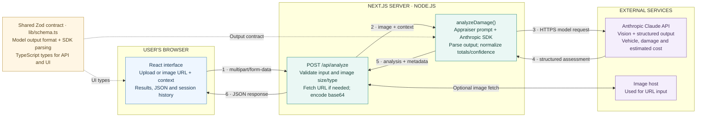
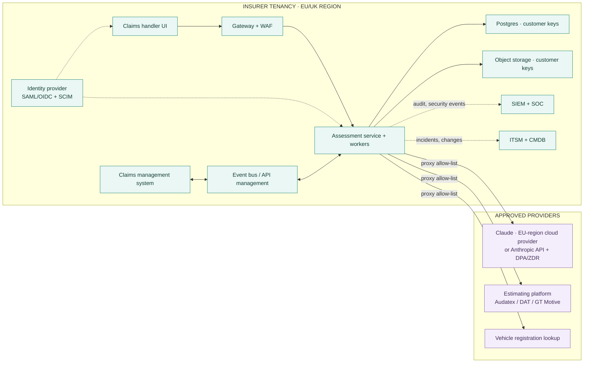

# Fenderly - implementation architecture

Current prototype: one Next.js application, one analysis endpoint, and one model invocation per assessment.

## Target enterprise deployment

Production at a European insurer runs inside the insurer's own tenancy. The prototype's Vercel hosting and public endpoint do not carry over.

Solid arrows are runtime data flow; dashed arrows are identity, logging, and operations integrations. The security tooling, identity provider, and operations systems are the insurer's existing services, confirmed in discovery. Details are in the [Production Readiness Plan](PRODUCTION_READINESS_PLAN_CISO.md), sections 3.7 and 3.8.

## Request walkthrough

The user submits a photo or URL with optional incident context. The Next.js API validates the input and prepares a base64 image. The AI layer makes one call to Claude with an appraiser prompt and a Zod-derived output schema. It parses the response, normalizes the total estimate range and identification confidence, and returns the assessment with model, timing, and token metadata. The browser renders the results on the same page. One schema connects the model interface to the application types.

## Implementation notes

- **Browser:** `app/page.tsx` downsizes uploaded images to a maximum 1600 px long edge. Recent analyses are kept in React memory, not durable storage. URL previews load directly in the browser; the optional server fetch shown above supplies the model's image bytes.
- **API:** `app/api/analyze/route.ts` accepts supported media up to 10 MB and applies a 15-second timeout to remote image fetching. Invalid input returns 400, missing API configuration 500, and analysis failures 502, with an error message displayed in the UI.
- **AI layer:** `lib/analyze.ts` contains the prompt, SDK call, refusal/missing-output handling, and normalization. The API key stays on the server. Model and effort are configurable through environment variables.
- **Contract:** `lib/schema.ts` supplies the output schema and inferred TypeScript types. The SDK parses the model response; the browser does not perform an additional runtime Zod validation. Schema conformity does not establish factual or pricing accuracy.
- **Assessment:** pricing comes from model judgment and prompt assumptions. The current normalization bounds and rounds total estimates and clamps identification confidence; it does not reconcile line-item sums against totals.
- **Prototype boundary:** the UI presents a first-pass assessment for review. There is no implemented approval workflow, claims database, policy integration, pricing lookup, agent loop, or response streaming. Solid arrows represent runtime data flow; dashed arrows represent code dependencies. The shared schema is a code module, not a deployed service.

The server boxes in the prototype diagram are modules within the same Next.js application, not separate microservices. In the enterprise diagram the assessment service and its workers are separate containers on the insurer's Kubernetes platform.
